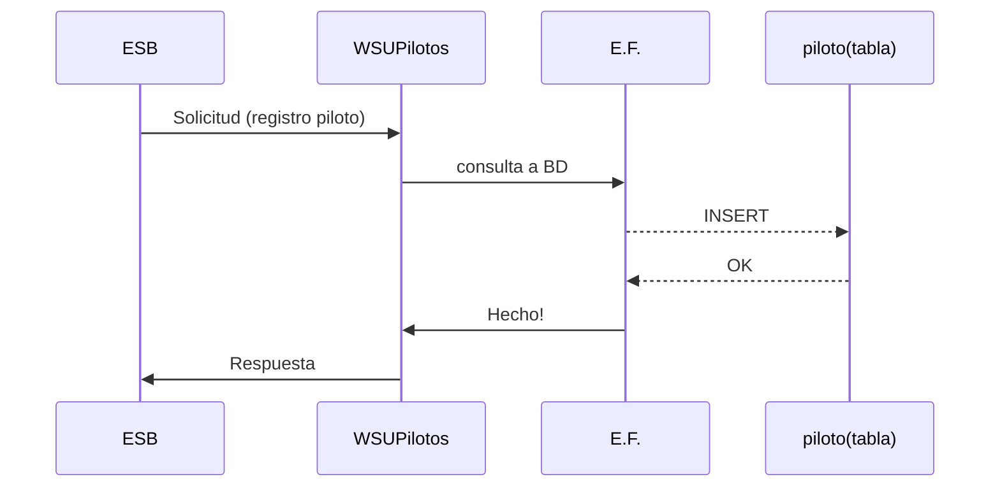

# Pilotos
## Web Service funciones pilotos

Servicio web que posee la lógica de solicitudes para los pilotos, este es un Micro Servicio que se encarga de procesar las solicitudes para agregar nuevos pilotos y finalizar los viajes pendientes por piloto desde el registro de los mismos.

# Clases

La clase principal y la que realiza la gestión de peticiones para los pilotos como tal se llamada `'WebService1'`. En esta podemos encontrar **WebMethod** necesarios para procesar las solicitudes de los pilotos:

|           |Metodo			|Parametros			| Return		|
|-----------|---------------|--------------------|--------------|
|**Pilotos**	|_AgregarPiloto_	|`String name` `String tel` `String marca` `String linea` `String placa`            | String
|**Pilotos**	|_FinalizarViaje_	|`int idPiloto`            | String

# Datos

La información de cada uno de los viajes se encuentra registrada en una **base de datos SQL**, la cual se conecta con el Micro Servicio **_WebService1_** por medio de  `ADO.NET Entity Framework`en su versión 5.0. 

## Diagrama UML 

! [Logo de GitHub] (UML.jpg)

A continuación se representa la solicitud de una petición proveniente del Orquestador (insertar piloto) y como el Micro Servicio de Pilotos se encarga de procesarla. 

## Formato Respuesta

El formato de respuesta para cada uno de los **WebMethod** esta definido como una cadena de caracteres _string_, sin embargo el formato de esta cadena es ta formada por una cadena separada por el simbolo `-` de la siguiente manera:
> "0-Usted finalizo el viaje con Piloto1"

> "1-El viaje no se pudo finalizar-0"

Dicha cadena contiene información relevante para cada una de las solicitudes, ya que el primer numero en dicha cadena contiene el resultado de la solicitud siendo:

|Codigo |Estado|
|-------|------|
|0		| Éxito|
|1		| Error|
