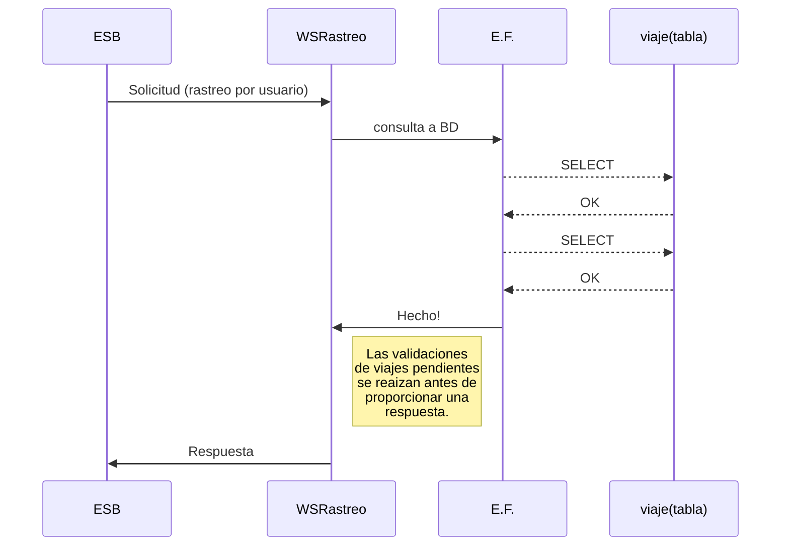

# RastreoCarro
## Web Service funciones rastreo

Servicio web que posee la lógica de solicitudes para los clientes y pilotos que desean conocer los datos del ultimo viaje activo, este es un Micro Servicio que se encarga únicamente de proporcionar información de los viajes, desde el registro de los mismos.

# Clases

La clase principal y la que realiza la gestión de peticiones para los usuarios y pilotos como tal se llamada `'Rastreo'`. En esta podemos encontrar **WebMethod** necesarios para recuperar la información de los viajes:

|           |Metodo			|Parametros			| Return		|
|-----------|---------------|--------------------|--------------|
|**Rastreo**	|_RastrearViajeUsuario_	|`int idUsuario`            | String
|**Rastreo**	|_RastrearViajePiloto_	|`int idPiloto`            | String

# Datos

La información de cada uno de los viajes se encuentra registrada en una **base de datos SQL**, la cual se conecta con el Micro Servicio **_Rastreo_** por medio de  `ADO.NET Entity Framework`en su versión 5.0. 

## Diagrama UML 

A continuación se representa la solicitud de una petición proveniente del Orquestador (Rastreo por usuario) y como el Micro Servicio de _Rastreo_ se encarga de procesarla. 

## Formato Respuesta

El formato de respuesta para cada uno de los **WebMethod** esta definido como una cadena de caracteres _string_, sin embargo el formato de esta cadena es ta formada por una cadena separada por el simbolo `-` de la siguiente manera:
> "0-Alan-Piloto1-Honda-Civic-895PPT-Zona1-Villa Nueva-13/08/2019"

> "1-No hay vijes pendientes-Sad But True!"

Dicha cadena contiene información relevante para cada una de las solicitudes, ya que el primer numero en dicha cadena contiene el resultado de la solicitud siendo:

|Codigo |Estado|
|-------|------|
|0		| Éxito|
|1		| Error|
