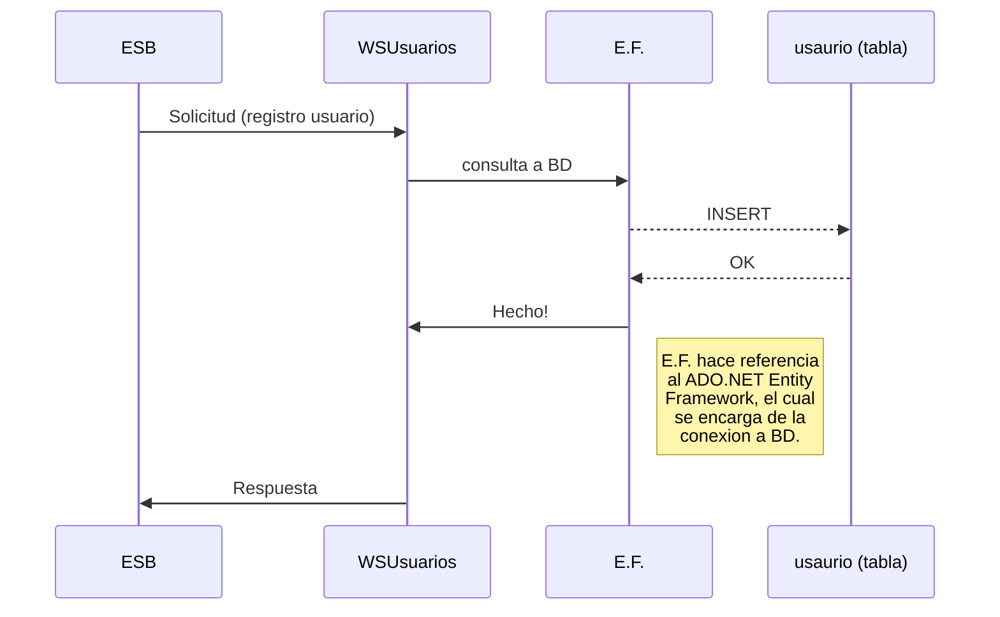
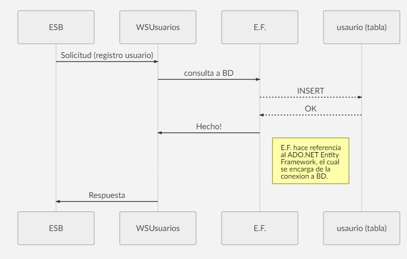

# Usuarios
## Web Service funciones clientes 

Servicio web que posee la lógica de solicitudes para los clientes o usuarios del sistema, este es un Micro Servicio que se encarga únicamente de a gestión de los clientes, desde el registro de los mismos, la validación de clientes en el sistema, hasta la gestiono de los viajes por usuario. 

# Clases

La clase principal y la que realiza la gestión de peticiones para los usuarios como tal se llamada `'Actividades_Usuario'`. En esta podemos encontrar **WebMethod** necesarios para la gestion de las solicitudes siguientes:

|           |Metodo			|Parametros			| Return		|
|-----------|---------------|--------------------|--------------|
|**Usuarios**	|_RegistrarUsuario_	|`String user` `String tel` `String unique` `String clave`            | bool
|**Usuarios**	|_logIn_	|`String user` `String clave`            | String
|**Usuarios**	|_PedirViaje_	|`int idUsuario` `String Origen` `String Destino`            | String
|**Usuarios**	|_FinalizarViaje_	|`int idUsuario`            | String

# Datos

La información de cada uno de los clientes se encuentra registrada en una **base de datos SQL**, la cual se conecta con el Micro Servicio **_Usuarios_** por medio de  `ADO.NET Entity Framework`en su versión 5.0. 

## Diagrama UML 

A continuación se representa la solicitud de una petición proveniente del Orquestador (insertar usuario) y como el Micro Servicio de Usuarios se encarga de procesarla. 

## Formato Respuesta

El formato de respuesta para cada uno de los **WebMethod** esta definido como una cadena de caracteres _string_, sin embargo el formato de esta cadena es ta formada por una cadena separada por el simbolo `-` de la siguiente manera:
> "0-Nuevo viaje asigndo.-Piloto1"

> "1-El viaje no se pudo registrar-0"

Dicha cadena contiene información relevante para cada una de las solicitudes, ya que el primer numero en dicha cadena contiene el resultado de la solicitud siendo:

|Codigo |Estado|
|-------|------|
|0		| Éxito|
|1		| Error|
